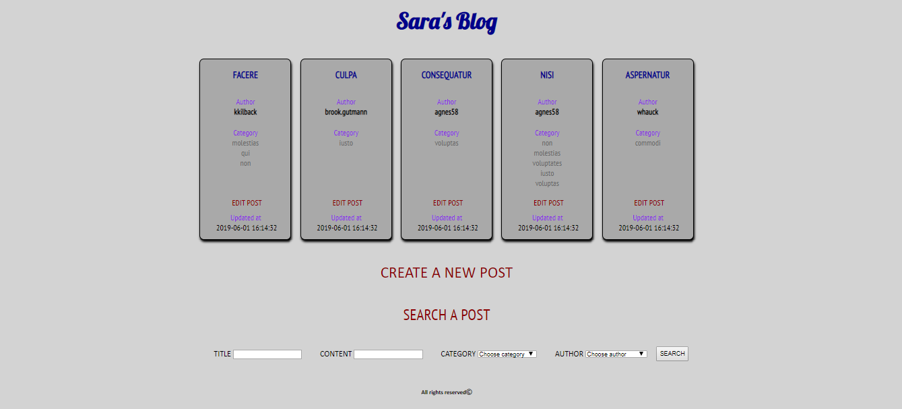
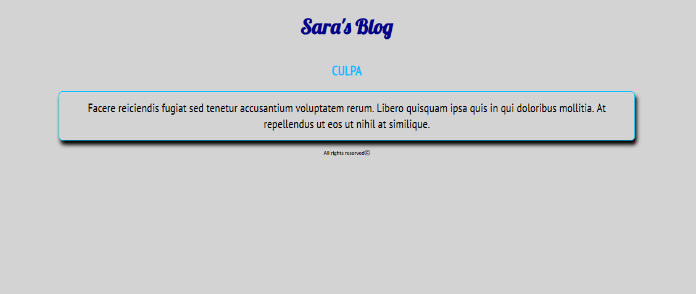
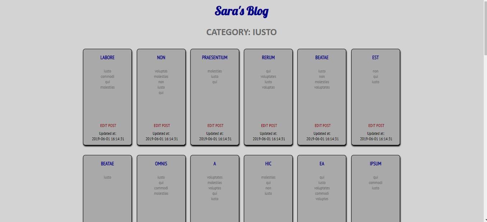
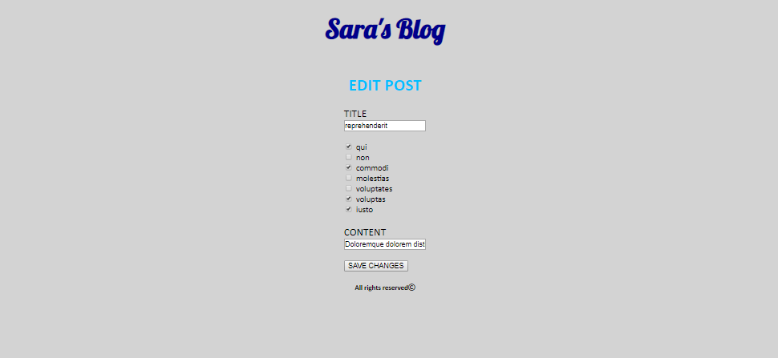

<h1>## Boolpress</h1>
Boolpress è una web application creata con Laravel. Si tratta di un simil-blog composto da varie pagine così formate: 
<ul>
  <li><b>Hompage</b> 
      Vengono mostrati in ordine cronologico gli ultimi 5 post del blog. Ogni posto occupa un riquadro in cui è contenuto titolo, autore, categorie di cui fa parte, il tasto per la modifica dello stesso post e la data di aggiornamento. 
    Nella homepage inoltre ci sono due tasti: uno per la creazione di un nuovo post e uno per la ricerca di un post esistente.</li>
  <li><b>Create new post</b> 
    Si tratta di una pagina formata da 4 richieste: TITLE, AUTHOR, CATEGORY e CONTENT. Questi campi vanno completati per la creazione del post;</li>
<li><b>Edit post</b> 
      Si tratta della pagina di modifica del post: graficamente è uguale alla create, ma ha la funzione di modificare il post in questione.</li>
    <li><b>Category</b> 
      Si tratta della pagina che mostra i post divisi per categorie. Si può accedervi tramite la homepage clickando su una categoria in un qualsiasi post.</li>
    
## Technologies used

Laravel, PHP, PhpMyAdmin, MySQL, SASS

## Screenshots

